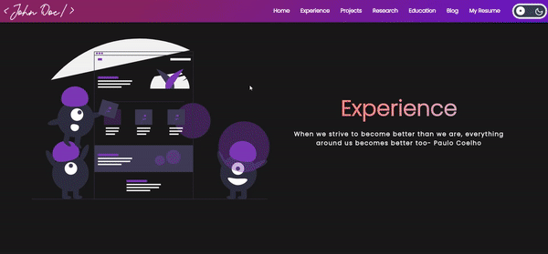

# My Portfolio Websites🌐

Well writing blog posts, working on some cool projects/papers/designs are a great way to do so. But there is something that you might be missing out on!

Here is the answer: An awesome personal website of yours that serves a portfolio of your work! 

If you do not have a platform that shows your entire work then you might not be doing justice in potraying your hard work or dope skills. But you must be wondering that making a portfolio website might take time, require some web development knowledge and still you might get something really cool. 

Well! Take a chill pill. Don't be intimidated by those thoughts. __Awesome Portfolio Wesbite__ is here for the rescue!

## A sneek peek into what we have here🙈 :

### Home Page:

### Experience Page:

### Project Page:

### Research Page:

### Education Page:

